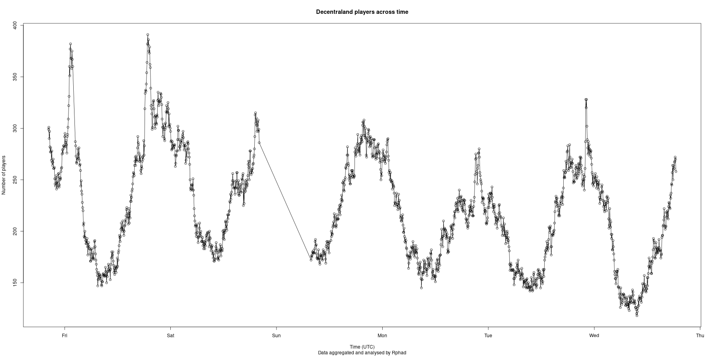

# Decentraland-Online-Users

**The dashboard is live ! See it on my website : https://www.rphad.com/dcl_dashboard**

## What is this repo about ?
This little repository includes a script that I use to fetch the amount of online users in [Decentraland](https://www.decentraland.org). It runs every 5 minutes on a Raspberry Pi, and I achieved that using a cron [cron](https://en.wikipedia.org/wiki/Cron) entry: `*/5 * * * *  node getOnlineUsers.js`.

## Installation

### Requirements

Clone this repo, `cd` into it and install the required Node modules (you can install them with `npm`) :
- `node-fetch`
- `csv-writer`

If you want to delete the csv and start with a new one, you'll need to create one with only the column names. Or you could change the value of `append` to false for the first run.

## How to run ?

If you do `node getOnlineUsers.js`, while having the minimal csv file required (explained in the last section), the timestamp and the number of users will be appended to the csv and printed to the console.

If you want to make a graph of the data, you will need [R](https://en.wikipedia.org/wiki/R_(programming_language)). Once you have it, just run `Rscript plot.r`

## Use as a data source 

Feel free to use the data of the csv as you want. Beware that, for now, I will update it manually so it may not be up to date. 

## Improvements
Potential improvements (PRs welcome) include : 

- ~~Running a basic static site that will display the results~~ DONE ! See the dashboard [here](https://www.rphad.com/dcl_dashboard)
- Check if there are additional nodes (the list is hardcoded)
- Display the online users per realm (1 node == 1 realm IIRC) 
- ~~Automatically update the csv on Github. (I may be the only one able to do this though)~~ DONE ! The csv file updates every hour. You can open an issue if you have a good reason to ask for a smaller interval.

## Donate

https://www.rphad.com/en/donate

## Comments

I love how the graph has a strong sine look. Also, I wasn't able to get data on the first sunday, could be due to several reasons but my guess is that one node wasn't up. The graph won't be automatically updated because it will quickly be messy since I plot all the data. The R script should be easy to understand though.

